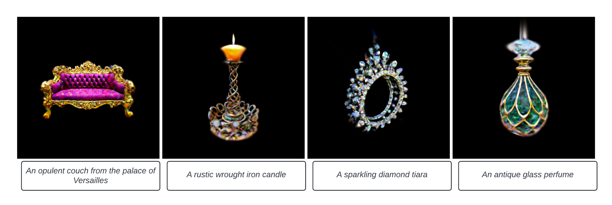

# Text-to-3D Mesh using Guassian Splatting and Variational Score Distillation


## CSE 252D: Advanced Computer Vision, Course Project, Spring 2024
### Team : Sai Aneesh Suryadevara, Nara Guru Naryanaswamy

### Prompt: "A sparkling Diamond Tiara"


## 🏁 Get Started
**Installation**
Install [3D Gaussian Splatting](https://github.com/graphdeco-inria/gaussian-splatting) and [Shap-E](https://github.com/openai/shap-e#usage) as fellow:
```
conda create -n gdreamer -y python=3.8

git clone https://github.com/hustvl/GaussianDreamer.git 

pip install torch==2.0.1+cu117 torchvision==0.15.2+cu117 torchaudio==2.0.2 --index-url https://download.pytorch.org/whl/cu117

pip install ninja

cd GaussianDreamer

pip install -r requirements.txt

conda install -c "nvidia/label/cuda-11.7.1" cuda-toolkit
conda install conda-forge::glm

pip install ./gaussiansplatting/submodules/diff-gaussian-rasterization
pip install ./gaussiansplatting/submodules/simple-knn
pip install plyfile
pip install ipywidgets
pip install open3d

git clone https://github.com/openai/shap-e.git
cd shap-e
pip install -e .

pip install git+https://github.com/bytedance/MVDream
```
Download [finetuned Shap-E](https://huggingface.co/datasets/tiange/Cap3D/resolve/9bfbfe7910ece635e8e3077bed6adaf45186ab48/our_finetuned_models/shapE_finetuned_with_330kdata.pth) by Cap3D, and put it in `./load`

https://huggingface.co/MVDream/MVDream/tree/main
**Quickstart**

Text-to-3D Mesh Generation
```
python launch.py --config configs/vivid_dreamer.yaml --train --gpu 0 system.prompt_processor.prompt="a fox"
cd SuGaR/
cd gaussian_splatting/submodules/diff-gaussian-rasterization/
pip install -e .
cd ../../../
python train.py -s ../gd_output/ -c ../gd_output/ -r "density"

```


## 📑 Citation
If you find this repository/work helpful in your research, welcome to give a ⭐.
This project is inspired from the works, Gaussian Dreamer, ProlificDreamer and SuGaR: Surface-Aligned Gaussian Splatting for Efficient 3D Mesh Reconstruction and High-Quality Mesh Rendering. Some source code of ours is borrowed from [Threestudio](https://github.com/threestudio-project/threestudio), [3DGS](https://github.com/graphdeco-inria/gaussian-splatting), [depth-diff-gaussian-rasterization](https://github.com/ingra14m/depth-diff-gaussian-rasterization). We sincerely appreciate the excellent works of these authors.
```
@inproceedings{yi2023gaussiandreamer,
  title={GaussianDreamer: Fast Generation from Text to 3D Gaussians by Bridging 2D and 3D Diffusion Models},
  author={Yi, Taoran and Fang, Jiemin and Wang, Junjie and Wu, Guanjun and Xie, Lingxi and Zhang, Xiaopeng and Liu, Wenyu and Tian, Qi and Wang, Xinggang},
  year = {2024},
  booktitle = {CVPR}
}

@misc{wang2023prolificdreamer,
      title={ProlificDreamer: High-Fidelity and Diverse Text-to-3D Generation with Variational Score Distillation}, 
      author={Zhengyi Wang and Cheng Lu and Yikai Wang and Fan Bao and Chongxuan Li and Hang Su and Jun Zhu},
      year={2023},
      eprint={2305.16213},
      archivePrefix={arXiv},
      primaryClass={cs.LG}
}

@article{guedon2023sugar,
  title={SuGaR: Surface-Aligned Gaussian Splatting for Efficient 3D Mesh Reconstruction and High-Quality Mesh Rendering},
  author={Gu{\'e}don, Antoine and Lepetit, Vincent},
  journal={arXiv preprint arXiv:2311.12775},
  year={2023}
}

```
